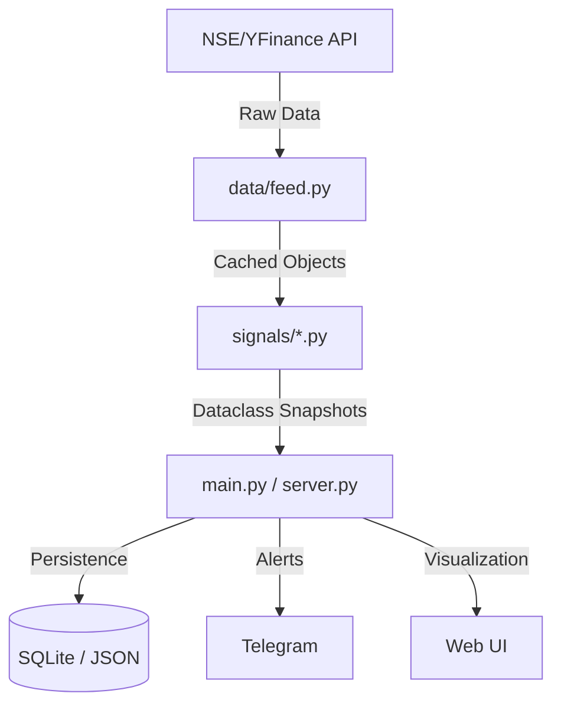

# Appflow Documentation - StockMinded

## 1. System Lifecycle (The Daily Loop)

### 1.1 Morning Routine (08:45 - 09:15 IST)
1. **Trigger**: Cron job starts the `dashboard` task.
2. **Ingest**: Fetch EOD data for 200 stocks and sector indices.
3. **Compute**: Run Regime, Flows, and Leadership modules.
4. **Broadcast**: Send Morning Alert to Telegram.
5. **Log**: Save snapshots to `regime_snapshots` and `flow_snapshots` tables.

### 1.2 Market Hours (09:15 - 15:30 IST)
1. **Automation Worker**: Ticks every N seconds.
2. **Entry Check**: If Automation is ON, check alerts against `OptionStrategy` rules.
3. **Execution**: Atomic update to `paper_trades.json` for new entries.
4. **Monitoring**: `check_option_exits` updates mark-to-market prices.
5. **Exit**: Trigger SL/TGT or EOD Gamma square-off.

### 1.3 Post-Market (15:30+ IST)
1. **Reporting**: Send EOD P&L summary to Telegram.
2. **Cleanup**: Run `scratch/cleanup_db.py` to manage disk space.

## 2. User Journey (Manual Mode)
1. **User** receives Telegram alert at 08:45 IST.
2. **User** opens Web Dashboard to review A-Grade stocks.
3. **User** selects a structure (e.g., Bull Call Spread) for Nifty.
4. **User** enters trade details manually in Dashboard or executes on real broker.
5. **System** tracks the paper trade and alerts on exit conditions.

## 3. Data Sync Flow

